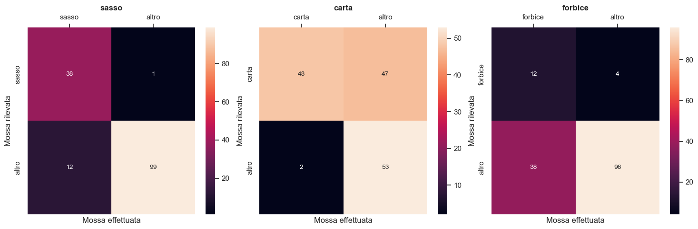

# Documentazione completa Morr-inoCinese - Michele Bolis & Andrea Galliano

## Indice

- [Documentazione completa Morr-inoCinese - Michele Bolis \& Andrea Galliano](#documentazione-completa-morr-inocinese---michele-bolis--andrea-galliano)
  - [Indice](#indice)
  - [Descrizione del progetto](#descrizione-del-progetto)
  - [Materiali e componenti utilizzati](#materiali-e-componenti-utilizzati)
  - [Funzionamento dettagliato](#funzionamento-dettagliato)
    - [Rilevamento della mossa](#rilevamento-della-mossa)
    - [Feedback e traduzione della mossa](#feedback-e-traduzione-della-mossa)
      - [Selezione della mossa corretta](#selezione-della-mossa-corretta)
      - [Riproduzione della mossa](#riproduzione-della-mossa)
  - [Dettagli implementativi](#dettagli-implementativi)
    - [Task Scheduler](#task-scheduler)
    - [Schema circuitale e schema elettrico](#schema-circuitale-e-schema-elettrico)
  - [Analisi statistica](#analisi-statistica)
  - [Demo di funzionamento](#demo-di-funzionamento)

## Descrizione del progetto

Il progetto prevede il rilevamento di una mossa del gioco della __*morra cinese*__, riprodotta con la propria mano, con conseguente stima di quest'ultima da parte di diversi classificatori. L'utente dovrà poi confermare la mossa effettuata attraverso tre pulsanti. Infine la mossa verrà *"tradotta"* da una mano meccanica.

Grazie al feedback dell'utente sulla mossa che ha effettuato, è stato possibile analizzare l'accuratezza dei classificatori utilizzati per predire la mossa effettuata.

## Materiali e componenti utilizzati

I materiali utilizzati per la realizzazione del progetto sono diversi e comprendono sia i __componenti elettronici__ sia i __componenti non elettronici__ (è il caso dei materiali usati per la realizzazione della mano meccanica *artigianale*).  

- __Componenti elettronici__:
  - ELEGOO UNO R3
  - 4 fotoresistenze (per il palmo della mano, per il rilevamento dell'indice, del medio e dell'anulare)
  - 5 servomotori (uno per ogni dito della mano da muovere)
  - 3 breadboard da 830 contatti
  - 7 resistenze da 10k Ohm
  - Cavi e jumper  
- __Componenti non elettronici__:
  - Cartoncino  
  - Foglio in gomma (dello spessore di mezzo *cm* circa)
  - Cannucce in plastica e carta
  - Filo di cotone

## Funzionamento dettagliato

Il funzionamento dettagliato del progetto si può dividere in 2 porzioni ben definite:  

1. [Rilevamento della mossa](#rilevamento-della-mossa)
2. [Feedback e traduzione della mossa](#feedback-e-traduzione-della-mossa)

### Rilevamento della mossa

La parte relativa al rilevamento di una mossa prevede l'utilizzo di __4 fotoresistenze__, poste in modo tale da percepire 4 punti fondamentali quando si intende effettuare una mossa:

- Il palmo della mano
- L'indice
- Il medio
- L'anulare  

Durante la fase di setup, in cui si presuppone che non ci siano "ostacoli" tra le fotoresistenze e la luce, vengono settati i __valori massimi__ che le fotoresistenze possono rilevare (per aumentare l'accuratezza della stima, questa è risultate dalla media di 20 rilevazioni).  

Per rilevare SE è presente o meno un dito su una fotoresistenza, applichiamo una diminuzione (del 5%-10% circa) alla luce massima rilevata e SE la luce rilevata attualente è minore, allora si considera tale fotoresistenza "coperta".  

Conteggio delle mosse rilevate:

- Una mossa è sasso SE solo la fotoresistenza del __palmo della mano__ è coperta.
- Una mossa è forbice SE sono coperte le fotoresistenza del __palmo__, dell'__indice__ e del __medio__.
- Una mossa è carta SE tutte le fotoresistenza risultano coperte, quindi __palmo__, __indice__, __medio__ e __anulare__.
- In tutti gli altri casi la mossa è considerata non riconosciuta.

La rilevazione della mossa effettiva inizia quando la fotoresistenza del palmo della mano risulta coperta, in quanto essa è comune a tutte le mosse. Il campionamento avviene in 5 secondi, in cui è richiesto all'utente di mantenere la mossa tramite stampa di appositi messaggi sulla __porta Seriale__.

Chiaramente se la luce ambientale cambiasse, sia nel caso in cui aumenti la luce (non si rileverebbe quasi mai una mossa) sia nel caso in cui diminuisca (si rileverebbe quasi sempre carta), sarebbe necessario un riavvio per rilevare nuovamente la luce massima.  

I diversi classificatori, date in input il numero di rilevazioni per mossa, restituiscono in output la codifica della mossa, in particolare:  
0 --> __Sasso__  
1 --> __Carta__  
2 --> __Forbice__  

Gli stimatori proposti sono:

- Lo __stimatore della moda__ emette la mossa in base alla moda tra le frequenze assolute delle mosse rilevate.

```C++
  int countMax = (max(max(max(nonRiconosciuto, carta), sasso), forbice));
```

- Lo __stimatore random__ emette la mossa scegliendo in maniera pseudo-casuale 1 delle 3 disponibili, ignorando quindi i campionamenti effettuati.

```C++
long randomSegno = random(3);
```

- Lo __stimatore carta__ emette sempre la mossa della carta.
- Lo __stimatore moda pesata__ applica uno scalare alle frequenze assolute, usando poi lo stimatore moda. In particolare ipotizzando molte mosse non riconosciute, dimezziamo tale frequenza e considerando la mossa della forbice la più problematica, applichiamo alle altre due mosse una diminuzione.

```C++
float pesoNonRiconosciuto = 0.5;
float pesoCarta = 0.8; 
float pesoSasso = 0.8;
float pesoForbice = 1;   
return stimatoreModa(nonRiconosciuto * pesoNonRiconosciuto, carta * pesoCarta, pesoSasso * sasso, pesoForbice * forbice);
```

A seguito della previsione di ciascuno stimatore, le mosse predette vengono stampate in output sulla console.  

**NB**: nel caso dello stimatore moda e della moda pesata, SE il segno "*nonRiconosciuto*" ha frequenza maggiore, si utilizza lo __stimatore random__ per avere comunque una mossa stimata e non avere degli NA nel dataset.

### Feedback e traduzione della mossa

La fase di feedback e traduzione della mossa è possibile dividerla ulteriormente in altre 2 sotto-fasi:  

1. [Selezione della mossa corretta](#selezione-della-mossa-corretta)
2. [Riproduzione della mossa](#riproduzione-della-mossa)  

#### Selezione della mossa corretta

In seguito alla stampa a video dei risultati degli stimatori, l'utente deve tener premuto uno dei 3 bottoni disponibili per segnalare la mossa che aveva effettuato.

```C++
int sasso = digitalRead(pins.bottone_sasso);
int carta = digitalRead(pins.bottone_carta);
int forbice = digitalRead(pins.bottone_forbice);
```

#### Riproduzione della mossa

Dopo la pressione del bottone, i servomotori di controllo delle dita della mano vengono mossi per riprodurre la scelta dell'utente, per poi ritornare in posizione *neutra* e attendere una nuova mossa.  

Prendiamo, ad esempio, il caso della mossa della forbice:

```C++
void servo_forbicePosition() {
  for (int pos = 180; pos >= 1; pos --) {
    mano.pollice.write(pos);
    mano.anulare.write(pos);
    mano.mignolo.write(pos);
    delay(15);
  }
}
```

Infine viene stampato un riassunto contenente la mossa che si è effettuata con le relative mosse predette dagli stimatori.  
Ora ricomincia tutto dalla lettura della luce per il rilevamento della mossa.

## Dettagli implementativi

### Task Scheduler

Per evitare l'utilizzo di delay e sfruttare il multitasking, è stata utilizzata la libreria __<TaskScheduler.h>__, la cui documentazione è consultabile dall'apposita [repository](https://github.com/arkhipenko/TaskScheduler).  

Grazie a questa libreria, è possibile istanziare un oggetto __*Scheduler*__, che permette la creazione di più task evitando di utilizzare la funzione __*delay()*__, che causerebbe un __blocco totale di tutti i processi__.  
Tutti i task sono stati istanziati basandosi sul __flusso di esecuzione__ del *setup()* e sul __flusso di esecuzione__ del *loop()*.  

- Flusso di esecuzione del *setup*:


**NB**: come misura di sicurezza per i servomotori, li facciamo muovere fino al raggiungimento della loro posizione di default nel caso in cui si sia interrotta la corrente mentre si stavano muovendo.  

- Flusso di esecuzione del *loop*:

  
Nel loop viene eseguito solo il loop dello scheduler in cui ci saranno dei task attivi.

- Flusso di esecuzione dello *scheduler*:


Lo scheduler, come si puo notare, è usato principalmente con un solo task attivo alla volta tranne dopo il campionamento.  

Grazie al __Task Scheduler__, è stato possibile separare il countdown, visibile a schermo, dal campionamento. In tal modo si può aumentare il numero di letture restando sempre nello stesso lasso di tempo del countdown, aumentando così la velocità di campionamento.  

Infine notiamo l'utilizzo dell'attivazione di un task (restart_idle_waitMossa) rimandato di 5 secondi cosicchè si potesse vedere la mossa effettuata dalla mano meccanica prima di farla tornare nella posizione di default.

### Schema circuitale e schema elettrico

Lo schema circuitale del progetto è consultabile attraverso una sua riproduzione in un progetto di [TinkerCard](https://www.tinkercad.com/things/3Kic4NV4jvM-copy-of-morr-ino/editel?tenant=circuits).  
Qui di seguito un suo screenshot:  


Lo schema elettrico invece è consultabile [qui](https://easyeda.com/editor#id=3ba47ce4e3224986a22450973c7e75b9).  
Qui di seguito un suo screenshot:  


## Analisi statistica

La terza ed ultima parte riguarda l'analisi statistica sui risultati emessi, atta a valutare la bontà degli stimatori scelti.  
I dati, stampati sulla porta seriale, vengono prelevati e inseriti all'interno di un [file di testo](../Statistiche/log.txt) grazie a [PuTTY](https://www.putty.org/), un particolare tipo di __Client__ che permette di accedere da remoto a sistemi informatici selezionando il tipo di connessione desiderata (nel nostro caso la connessione __*serial*__).  

Come dataset consideriamo il riassunto finale che viene stampato dopo aver premuto uno dei tre pulsanti. Ciò risulta necessario in quanto le mosse effettuate e predette da ogni stimatore devono essere della stessa dimensione.  

Come strumento teorico per la verifica della bontà di uno stimatore, utilizziamo la *matrice di confusione*, nella sua versione quadrata 2x2.  
Consideriamo infatti una matrice per ogni stimatore per ogni mossa:
|                            |        |Mossa effettuata       | Mossa effettuata       |                                          |  
|----------------------------|--------|-----------------------|-----------------------|------------------------------------------|
|                            |        |__Positivo__           |__Negativo__           |                                          |
|__Mossa predetta__|Positivo|__VP__, Veri Positivi  |__FP__, Falsi Positivi |__TOT CP__, totale classificati positivi  |
|__Mossa predetta__|Negativo|__FN__, Falsi negativi |__VN__, Veri Negativi  |__TOT CN__, totale classificatori negativi|
|                            |        |__TP__, Totale Positivi|__TN__, Totale Negativi|                                          |

Per ogni mossa, dato uno stimatore, è possibile calcolarne la __sensibilità__ e la __specificità__.  

- __Sensibilità__ --> Capacità del classificatore di lavorare con i positivi.  
$$Sensibilità = {VP \over TP} $$
- __Specificità__ --> Capacità del classificatore di lavorare con i negativi.
$$Specificità = {VN \over TN} $$

Dal punto di vista grafico, rappresentiamo la matrice di confusione con una __mappa di calore__, nel caso migliore infatti ci aspettiamo che la concentrazione dei valori sia nelle posizioni (0, 0) e (1, 1).  
Risultati ottenuti:

- Classificatore __moda__
  - Sasso: nei casi positivi lavora quasi sempre correttamente (97%) mentre commette degli errori non rilevando la mossa del sasso nel 10% circa dei casi.
  - Carta: notiamo come il classificatore commetta molti falsi positivi.
  - Forbice: notiamo che il classificatore, come probabile conseguenza dei falsi positivi della carta, commetta molti falsi negativi non rilevando quindi correttamente la forbice.

  
  
- Classificatore __casuale__: come ci aspettavamo, la sensibilità per le tre mosse si aggira in un intorno del 33,3% mentre la specificità in un intorno del 66,6%. Le mosse infatti sono predette in modo casuale con una probabilità uguale per ciascuna mossa che quindi ha il 33,3% di possibilità di essere "scelta". La sensibilita media infatti è del 32,6% mentre la specificità media del 66,8%.
  
  
- Classificatore __carta__: scegliendo sempre la mossa della carta, solo questa avrà una sensibilita non nulla, in particolare del 33,3% mentre le altre mosse avranno specificità del 66,6%.
  
  
- Classificatore __moda pesata__: rispetto al classificatore della moda, notiamo un miglioramente generale sia per la sensibilità che per la specificatà (sia per le singole mosse che mediamente), soprattutto per quanto riguarda la mossa dell forbice, considerata quella più problematica.
  
  

Il codice completo dell'analisi statistica è consultabile [qui](/Statistiche/stats.ipynb).

## Demo di funzionamento

Qui riportate delle foto del progetto e dei link per prendere visione dei video di demo del funzionamento dell'intero circuito.

- **Foto completa del progetto:**


- **Foto completa del progetto (dall'alto):**


- **Foto del circuito relativo alla mano controllata dai servomotori:**


- **Foto del circuito relativo alle fotoresistenze:**


Qui di seguito i link Google Drive per visualizzare le demo di funzionamento:

- [Mossa sasso](https://drive.google.com/file/d/1U6gLr4jH_8dBaV2jkoux5j-k9-5gwm0W/view?usp=sharing)
- [Mossa forbice](https://drive.google.com/file/d/1X2ugpWjyJjUMjBYs63GH24JkOhWEugbO/view?usp=sharing)
